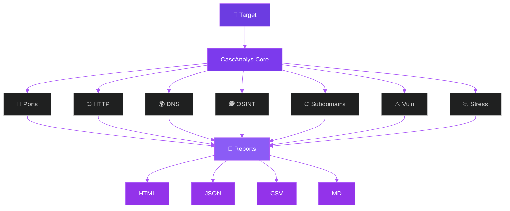
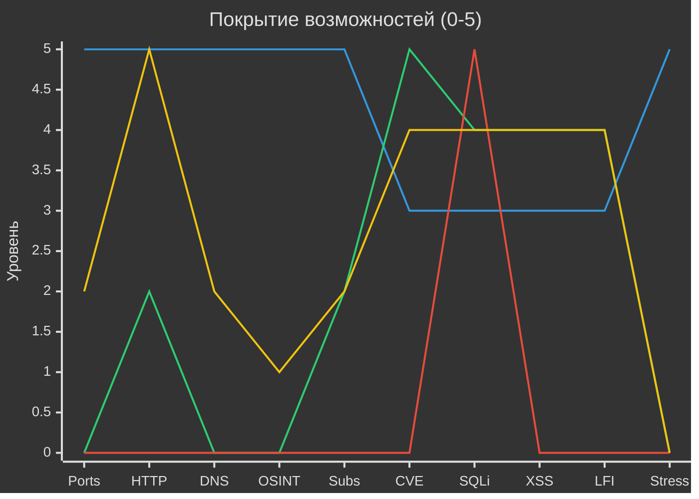

<div align="center">


<a href="https://github.com/seismon/casc-anays">
  
</a>

<br>

<a href="https://www.python.org/">
  
</a>
<a href="LICENSE">
  
</a>


<br>


<br>

<a href="https://github.com/seismon/casc-anays/stargazers">
  
</a>
<a href="https://github.com/seismon/casc-anays/network/members">
  
</a>
<a href="https://github.com/seismon/casc-anays/issues">
  
</a>
<a href="https://github.com/seismon/casc-anays/commits/main">
  
</a>

<br><br>

<a href="https://t.me/cascadom">
  
</a>

<br><br>


</div>

<br>

<h2 align="center">🌊 О Cascada Project</h2>

<br>

<div align="center">

**CASC-ANAYS** — это инструмент проекта **Cascada Project** — сообщества по кибербезопасности<br>
в Telegram-сегменте, посвящённого пентесту, OSINT, bug bounty и веб-безопасности.

<br>

<a href="https://t.me/cascadom">
  
</a>

<br><br>

**📢 Telegram-канал:** [@cascadom](https://t.me/cascadom)

<br><br>

В канале **Cascada Project** вы найдёте:

```
🔥  Инструменты для пентеста и OSINT
🛠  Гайды по веб-безопасности и bug bounty
💡  Свежие CVE и техники эксплуатации
🐛  Методологии поиска уязвимостей
🎓  Обучающие материалы по кибербезопасности
👥  Сообщество единомышленников
```

</div>

<br>


<br>

<h2 align="center">💜 Что такое CASC-ANAYS?</h2>

<br>

<p align="center">
  <b>CASC-ANAYS</b> — это модульный <b>pentest toolkit</b> и <b>vulnerability scanner</b><br>
  для <b>web reconnaissance</b>, <b>OSINT</b> и <b>bug bounty</b>.<br><br>
  Он объединяет <b>40+ популярных GitHub-инструментов</b> и <b>7 собственных модулей</b><br>
  в единую CLI-систему с красивым выводом, интерактивным режимом<br>
  и генерацией отчётов в <b>4 форматах</b>.
</p>

<br>

<p align="center">
  
  
  
  
</p>

<br>

<div align="center">

> ### ⚠️ ВНИМАНИЕ
> *Используйте только против целей, на которые у вас есть **письменное разрешение**.*<br>
> *Автор не несёт ответственности за неправомерное использование.*

</div>

<br>


<br>

<h2 align="center">🏗 Архитектура</h2>

<br>

<div align="center">



</div>

<br>

<p align="center">
  <b>Поток данных:</b> Target → CascAnalys Core → 7 модулей анализа → Reports (4 формата)
</p>

<br>


<br>

<h2 align="center">⚡ Установка за 30 секунд</h2>

<br>

<div align="center">

### 🐍 Через Python

</div>

```bash
# 1. Клонирование
git clone https://github.com/seismon/casc-anays.git
cd casc-anays

# 2. Зависимости
# Kali / Debian / Ubuntu:
pip install --break-system-packages -r requirements.txt
# Обычная система:
pip install -r requirements.txt

# 3. Проверка
python3 casc_anays.py --deps
python3 casc_anays.py --self-test

# 4. Запуск
python3 casc_anays.py -i
```

<div align="center">

### 🐳 Через Docker

</div>

```bash
docker build -t casc-anays:4.0 .

docker run -it --rm \
    -v $(pwd)/reports:/app/reports \
    -v $(pwd)/repos:/app/repos \
    casc-anays:4.0 -i
```

<br>


<br>

<h2 align="center">🎬 Быстрый старт</h2>

<br>

<div align="center">
  
</div>

```bash
# 🎯 Полный анализ одного домена
python3 casc_anays.py -t example.com --full

# 🧠 Умный анализ (авто-подбор модулей по результатам разведки)
python3 casc_anays.py -t example.com --smart

# 🖥 Интерактивный режим (меню из 12 пунктов)
python3 casc_anays.py -i

# 🎨 Только порты и HTTP
python3 casc_anays.py -t example.com -m ports,http

# 🛡 Без стресс-тестов (безопасно для прода)
python3 casc_anays.py -t example.com --full --no-stress

# 📄 Список целей из файла
python3 casc_anays.py --targets-file targets.txt --smart

# 📊 Множество целей + CSV-отчёт
python3 casc_anays.py --targets-file targets.txt --smart --format csv

# 📦 Клонировать все инструменты с GitHub
python3 casc_anays.py --init-repos --install-deps

# 🌐 Через Tor
python3 casc_anays.py -t example.com --smart --proxy socks5://127.0.0.1:9050
```

<div align="center">
  <br>
  <b>Пример <code>targets.txt</code>:</b>
</div>

```txt
# Мои цели
example.com
test.com
192.168.1.1
https://sub.example.com
```

<br>


<br>

<h2 align="center">🧩 Модули анализа</h2>

<br>

<div align="center">

### 🔌 Сканирование портов &nbsp;•&nbsp; `ports`

</div>

```
TCP + UDP · ~200 популярных портов · Баннеры сервисов · Детект рисков
Параллельное сканирование (100 воркеров) · Graceful shutdown
```

<div align="center">

### 🌐 HTTP-анализ &nbsp;•&nbsp; `http`

</div>

```
Заголовки · Редиректы · Cookies · Title · Security headers
SSL/TLS — issuer, subject, SAN, days_left, версия, шифр
WAF-детект — Cloudflare, Sucuri, AWS WAF, Akamai, Imperva, F5, ModSecurity, Barracuda, Fastly, Varnish
Технологии — nginx, apache, iis, php, java, wordpress, laravel, django
```

<div align="center">

### 🌍 DNS-анализ &nbsp;•&nbsp; `dns`

</div>

```
A · AAAA · MX · NS · TXT · CNAME · SOA · CAA · SRV
DMARC · PTR · SPF · детект почтовых записей
```

<div align="center">

### 🕵 OSINT / WHOIS &nbsp;•&nbsp; `osint`

</div>

```
Registrar · Даты создания/истечения · Name Servers · Статусы · Emails · Organization
```

<div align="center">

### 🌐 Поиск поддоменов &nbsp;•&nbsp; `subdomains`

</div>

```
crt.sh (Certificate Transparency)  →  Certificate logs
Sublist3r                           →  Пассивный поиск
amass                               →  OWASP-фреймворк
subfinder                           →  ProjectDiscovery
DNS-брутфорс                        →  100+ популярных имён
```

<div align="center">

### ⚠️ Уязвимости &nbsp;•&nbsp; `vuln`

</div>

```
CVE            →  NVD API (онлайн) + offline-база
                  nginx · apache · openssh · php · wordpress · openssl · iis
Nikto          →  Web server scanner (реальный запуск)
SQL Injection  →  Error-based, 13 payload'ов, 22 сигнатуры СУБД
                  MySQL · PostgreSQL · MSSQL · Oracle · SQLite
XSS            →  Reflected, 12 payload'ов, уникальный маркер
LFI            →  Path traversal · null-byte · php://filter, 13 payload'ов
```

<div align="center">

### 💥 Стресс-тесты &nbsp;•&nbsp; `stress`

</div>

```
Slowloris   →  Медленные соединения с keep-alive
HTTP-флуд   →  Множество запросов через requests.Session
GoldenEye   →  Через клонированный репозиторий
```

<div align="center">
<br>
<b>Комбинирование модулей:</b>
</div>

```bash
# Только порты и HTTP
python3 casc_anays.py -t example.com -m ports,http

# Только уязвимости
python3 casc_anays.py -t example.com -m vuln

# Всё кроме стресса (безопасно для прода)
python3 casc_anays.py -t example.com --full --no-stress

# Всё кроме уязвимостей
python3 casc_anays.py -t example.com --full --no-vuln
```

<br>


<br>

<h2 align="center">⚖️ Сравнение с альтернативами</h2>

<br>

<p align="center">
  <i>CASC-ANAYS — это <b>комбайн для первичной разведки</b>,<br>
  а не замена специализированным инструментам</i>
</p>

<br>

<div align="center">



</div>

<br>

<div align="center">

**CASC-ANAYS** выигрывает в **широте охвата** — 7 модулей в одном CLI,<br>
включая уникальные для подобных тулзов **порт-сканер**, **DNS-анализ**, **WHOIS** и **стресс-тесты**.

**Nuclei** — лидер по **CVE-шаблонам** (тысячи готовых проверок).<br>
**SQLMap** — незаменим для **глубокой эксплуатации SQLi**.<br>
**OWASP ZAP** — лучший выбор для **ручного тестирования с GUI**.

</div>

<br>

<div align="center">

### 🎯 Когда что использовать

```
🐉 CASC-ANAYS  →  Быстрая первичная разведка, единый CLI, 7 модулей
🔬 Nuclei      →  Глубокий поиск CVE по шаблонам
💉 SQLMap      →  Глубокая эксплуатация SQL-инъекций
🛡 OWASP ZAP   →  Ручное тестирование с GUI и прокси
```

</div>

<br>

<div align="center">

> **Вывод:** CASC-ANAYS — это **комбайн для первичной разведки**.<br>
> Он **не заменяет** специализированные тулзы (Nuclei, SQLMap, ZAP),<br>
> а **объединяет** их в один CLI. Используйте CASC-ANAYS для быстрого сбора<br>
> данных о цели, потом — целевые тулзы для глубокого анализа.

</div>

<br>


<br>

<h2 align="center">📦 40+ GitHub-репозиториев</h2>

<br>

<p align="center">
  <i>Автоматическое клонирование, обновление, проверка целостности<br>
  и установка зависимостей (pip / npm / go / bundle)</i>
</p>

<br>

<div align="center">

**🕵 OSINT (12)** — поиск по 3000+ соцсетям, email, телефонам, Instagram, Google-аккаунтам

```
sherlock · whatsmyname · maigret · theharvester · spiderfoot · ghunt
photon · osintgram · h8mail · holehe · trape · torbot
```

**🌐 Поддомены (9)** — 5 источников + DNS-брутфорс

```
sublist3r · amass · subfinder · findomain · subcat
subdomain-enumerator · subdomain-enum-tool · dnsrecon · certinfo
```

**⚠️ Уязвимости (12)** — web-сканеры, CMS, секреты в git

```
nikto · nuclei · web-vuln-scanner · wpscan · joomscan · cmsmap
cmseek · cms-vuln-scanner · jaeles · gitleaks · trufflehog · wordpress-plugins
```

**💥 Стресс (4)** — Slowloris, HTTP-флуд, L7 DDoS

```
floodles · ddos-attack · slowloris · goldeneye
```

**📚 Словари (2)** — SecLists (~1.5GB) и FuzzDB

```
seclists · fuzzdb
```

**🔧 Вспомогательные (1)** — поиск реального IP за CDN

```
behindthecdn
```

</div>

<br>

<div align="center">
<b>Управление:</b>
</div>

```bash
python3 casc_anays.py --init-repos                    # Клонировать всё
python3 casc_anays.py --init-repos --all              # Включая тяжёлые
python3 casc_anays.py --init-repos --parallel         # Параллельно
python3 casc_anays.py --init-repos --install-deps     # + зависимости
python3 casc_anays.py --update-repos                  # Обновить
python3 casc_anays.py --list-repos                    # Список с размерами
python3 casc_anays.py --clean-repos                   # Удалить всё
```

<br>


<br>

<h2 align="center">📄 Отчёты</h2>

<br>

<div align="center">

### 🎨 HTML &nbsp;—&nbsp; фиолетовая тема

</div>

```
╭─────────────────────────────────────────────────╮
│  🌌 Интерактивный отчёт                         │
│     • Collapsible-секции                        │
│     • Адаптивный дизайн                         │
│     • Всё в одном файле                         │
│     • Работает offline                          │
╰─────────────────────────────────────────────────╯
```

```
📊 Сводная статистика        🔌 Порты с рисками
🌐 HTTP + технологии         🔒 SSL/TLS + SAN
🌍 DNS + флаги               🕵 WHOIS
🌐 Поддомены                 ⚠️ Уязвимости по severity
💥 Стресс-тесты
```

<br>

<div align="center">

### 📸 Пример отчёта

👉 [**Открыть живой HTML-отчёт**](examples/report_dvwa.html) *(сканирование DVWA)*

</div>

<br>

<div align="center">

### Другие форматы

</div>

**📋 JSON** — полная структура с метаданными (generator, version, timestamp, author) и всеми результатами. Идеален для интеграции с другими инструментами и автоматизации.

**📊 CSV** — плоская таблица уязвимостей с колонками `Target, IP, Type, Name, Severity, Description, URL, Param, CVE, Evidence`. Открывается в Excel / Google Sheets.

**📝 Markdown** — для GitHub-README, issue-трекеров или документации. Содержит те же секции, что HTML, но в текстовом формате.

<br>

<div align="center">
<b>Форматы вывода:</b>
</div>

```bash
python3 casc_anays.py -t example.com --smart                    # HTML + JSON
python3 casc_anays.py -t example.com --smart --format html      # Только HTML
python3 casc_anays.py -t example.com --smart --format csv       # CSV
python3 casc_anays.py -t example.com --smart --format all       # Все 4
python3 casc_anays.py -t example.com --smart -o my_report.html  # Свой путь
python3 casc_anays.py -t example.com --smart --open             # + открыть в браузере
```

<br>


<br>

<h2 align="center">🖥 Интерактивный режим</h2>

<br>

```bash
python3 casc_anays.py -i
```

<div align="center">

```
╔══════════════════════════════════════════════════════════════╗
║                                                              ║
║               CASC-ANAYS — ИНТЕРАКТИВНЫЙ РЕЖИМ               ║
║                                                              ║
╚══════════════════════════════════════════════════════════════╝

  [1]  🎯 Анализ цели (полный)
  [2]  🧠 Умный анализ
  [3]  📁 Управление целями
  [4]  📦 Инициализация репозиториев
  [5]  📋 Список целей
  [6]  🗂  Список репозиториев
  [7]  📊 Показать статистику
  [8]  📄 Генерировать HTML-отчёт
  [9]  📋 Генерировать JSON-отчёт
  [10] 💾 Экспорт результатов
  [11] ⚙️  Настройки
  [0]  🚪 Выход
```

</div>

<br>


<br>

<h2 align="center">📈 Бенчмарки</h2>

<br>

<p align="center">
  <b>Тестовая среда:</b> Kali Linux · Python 3.11 · Intel i7 · 16 GB RAM
</p>

<br>

<div align="center">

**Сканирование портов (TCP)** — около **430 портов/сек** (timeout 0.5s, 100 воркеров)

**DNS-брутфорс поддоменов** — около **8 имён/сек** (по встроенному словарю 100+ имён)

**Количество payload'ов:**
- SQLi — **13** (error-based, 22 сигнатуры СУБД)
- XSS — **12** (reflected, уникальный маркер)
- LFI — **13** (path traversal, null-byte, wrappers)

**Тайминги анализа:**
- Быстрая разведка (ports+http+dns) — **30–60 сек**
- Умный режим — **1–3 мин**
- Полный анализ (все 7 модулей) — **5–15 мин**

</div>

<br>

<div align="center">
<b>Воспроизвести:</b>
</div>

```bash
python3 benchmarks/bench.py
```

<br>


<br>

<h2 align="center">🧪 Тестирование</h2>

<br>

```bash
python3 casc_anays.py --self-test
```

<div align="center">

```
╔════════════════════════════════════════════════════════════════════╗
║                    CASC-ANAYS — САМОТЕСТИРОВАНИЕ                  ║
╚════════════════════════════════════════════════════════════════════╝

  ✓ Utils                Utils: 11 проверок
  ✓ Target               Target: 8 проверок
  ✓ Config               Config: 5 проверок
  ✓ Logger               Logger: 2 проверки
  ✓ PortScanner          PortScanner: 4 проверки
  ✓ HTTPAnalyzer         HTTPAnalyzer: 4 проверки
  ✓ DNSAnalyzer          DNSAnalyzer: 3 проверки
  ✓ OSINTModule          OSINTModule: 2 проверки
  ✓ CVEScanner           CVEScanner: 4 проверки
  ✓ SQLiScanner          SQLiScanner: 3 проверки
  ✓ XSSScanner           XSSScanner: 3 проверки
  ✓ LfiScanner           LfiScanner: 2 проверки
  ✓ StressTester         StressTester: 3 проверки
  ✓ HTMLReport           HTMLReport: 4 проверки
  ✓ JSONReport           JSONReport: 3 проверки
  ✓ CSVReport            CSVReport: 2 проверки
  ✓ MarkdownReport       MarkdownReport: 2 проверки
  ✓ AppState             AppState: 3 проверки
  ✓ ProgressBar          ProgressBar: 1 проверка
  ✓ CascAnalys           CascAnalys: 8 проверок

  ──────────────────────────────────────────────────────────────────
  ✓ ВСЕ ТЕСТЫ ПРОЙДЕНЫ: 20/20
  ──────────────────────────────────────────────────────────────────
```

</div>

<br>


<br>

<h2 align="center">📁 Структура проекта</h2>

<br>

```bash
casc-anays/
│
├── 🐍 casc_anays.py            # Главный монолит (~8300 строк)
│
├── 📦 part1_repos.py           # Ядро: Logger, Config, Utils, Target
├── 📦 part2_repos.py           # RepoManager, 40 репозиториев
├── 📦 part3_analysis.py        # Ports, HTTP, DNS, OSINT, Subdomains
├── 📦 part4_vuln.py            # CVE, Nikto, SQLi, XSS, LFI, Stress
├── 📦 part5_integration.py     # Главный класс CascAnalys
├── 📦 part6_reports.py         # HTML/JSON/CSV/MD + Interactive
├── 📦 part7_cli.py             # CLI, тесты, main()
│
├── 📂 examples/                # Готовые примеры отчётов
│   ├── report_dvwa.html
│   ├── report_dvwa.json
│   ├── report_dvwa.csv
│   ├── report_dvwa.md
│   └── README.md
│
├── 📂 benchmarks/              # Бенчмарки
│   └── bench.py
│
├── 📂 docs/                    # Документация и медиа
│   └── architecture.md
│
├── 🔧 build.sh                 # Сборка монолита
├── ⚙️  config.json              # Конфигурация
├── 📋 requirements.txt         # Python-зависимости
├── 🐳 Dockerfile               # Docker-образ
├── 🚫 .gitignore
├── 📖 README.md
├── 📜 LICENSE
│
├── 📊 reports/                 # Отчёты (создаётся автоматически)
└── 📦 repos/                   # Клонированные репозитории
```

<div align="center">
<b>Пересборка монолита:</b>
</div>

```bash
./build.sh
# → casc_anays.py (8300+ строк)
```

<br>


<br>

<h2 align="center">❓ FAQ</h2>

<br>

<details>
<summary><b>🔒 Нужны ли права root?</b></summary>

Нет. Работает от обычного пользователя. Root нужен только для портов < 1024 на некоторых системах.
</details>

<details>
<summary><b>⏱ Сколько времени занимает полный анализ?</b></summary>

```
Быстрая разведка (ports+http+dns)    →  30–60 сек
Умный режим                            →  1–3 мин
Полный анализ (все 7 модулей)          →  5–15 мин
С поддоменами через amass/subfinder    →  10–20 мин
```
</details>

<details>
<summary><b>🌐 Как использовать через Tor?</b></summary>

Запусти Tor, затем:

```bash
python3 casc_anays.py -t example.com --smart \
    --proxy socks5://127.0.0.1:9050
```
</details>

<details>
<summary><b>🛠 Git не найден. Что делать?</b></summary>

```bash
# Debian / Ubuntu / Kali
sudo apt install git -y

# CentOS / RHEL
sudo yum install git -y

# macOS
brew install git
```

Проверь: `python3 casc_anays.py --check-git`
</details>

<details>
<summary><b>📚 Можно ли использовать как библиотеку?</b></summary>

Да:

```python
from casc_anays import CascAnalys

app = CascAnalys("config.json")
app.add_target("example.com")
result = app.analyze_target(app.targets[0])
print(result)
```
</details>

<details>
<summary><b>➕ Как добавить свой репозиторий?</b></summary>

Открой `config.json`, добавь в секцию `repos`:

```json
"my_tool": {
    "url": "https://github.com/user/my_tool.git",
    "branch": "main"
}
```

Затем:

```bash
python3 casc_anays.py --init-repos --list-repos
```
</details>

<details>
<summary><b>💥 Почему стресс-тесты по умолчанию включены?</b></summary>

Они **малые** (20 соединений / 50 запросов / 3 сек) и не навредят нормальному серверу. Отключить: `--no-stress`.
</details>

<br>


<br>

<h2 align="center">⚠️ Дисклеймер</h2>

<br>

<div align="center">

<b>CASC-ANAYS</b> создан для <b>легального</b> тестирования на проникновение и аудита безопасности.

<br><br>

### ✅ РАЗРЕШЕНО

```
Собственные системы
Системы с письменным разрешением владельца
Bug bounty программы (в рамках scope)
CTF-задачи
Учебные лаборатории
```

### ❌ ЗАПРЕЩЕНО

```
Сканировать чужие сайты без разрешения
Использовать для DDoS
Нарушать законы вашей страны
```

<br>

**Автор не несёт ответственности за неправомерное использование.**

</div>

<br>


<br>

<h2 align="center">🤝 Contributing</h2>

<br>

<p align="center">
  Pull requests приветствуются!<br>
  Для крупных изменений — сначала открой issue.
</p>

```bash
# 1. Fork репозитория
# 2. Создай ветку
git checkout -b feature/amazing

# 3. Commit
git commit -m 'Add amazing feature'

# 4. Push
git push origin feature/amazing

# 5. Открой Pull Request
```

<br>


<br>

<h2 align="center">📜 Лицензия</h2>

<br>

<div align="center">

<b>MIT License</b> © <a href="https://github.com/seismon">seismon</a>

См. <a href="LICENSE">LICENSE</a> для деталей.

</div>

<br>


<br>

<h2 align="center">🙏 Благодарности</h2>

<br>

<div align="center">

Особая благодарность авторам <b>40+ инструментов</b>,<br>
чьи репозитории используются в проекте.

<br><br>

<b>OWASP</b> — за amass<br>
<b>ProjectDiscovery</b> — за subfinder и nuclei<br>
<b>Сообществу Cascada Project</b> — за поддержку и тестирование

</div>

<br>


<br>

<div align="center">


<br>


<br>

<a href="https://t.me/cascadom">
  
</a>
<a href="https://github.com/seismon">
  
</a>
<a href="https://github.com/seismon/casc-anays/stargazers">
  
</a>

<br><br>

<b>⭐ Поставь звезду, если проект полезен!</b>

<br><br>

<code>CASC-ANAYS v4.0</code> &nbsp;•&nbsp; <code>Cascada Project</code> &nbsp;•&nbsp; <code>2026</code>

<br><br>

<a href="https://t.me/cascadom">
  
</a>

</div>
